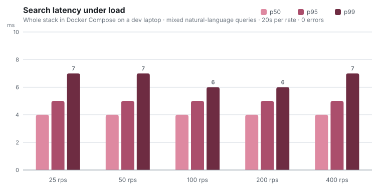

# 🧭 Fernweh

*Fernweh (German): the ache for far-off places.*

A working slice of an AI-first travel platform: natural-language search with
zero dead ends, personalized ranking with bounded business rules, and a
self-healing content pipeline. Four Go services, no web framework, built with
Claude Code and owned end to end: spec, code, tests, tracing, deploy.

**Why this exists:** it is a portfolio project deliberately shaped like a
production travel backend. Same stack, same operational concerns, same product
trade-offs. The specs live in [docs/PRD.md](docs/PRD.md); the AI-assisted
workflow, including the bugs the AI wrote and how they were caught, is in
[docs/BUILDLOG-claude-code.md](docs/BUILDLOG-claude-code.md).

## Try it in two minutes

```bash
git clone https://github.com/Vijay190899/fernweh && cd fernweh
cp .env.example .env        # optional: add an OpenRouter key for live AI
docker compose up --build   # postgres + redis + jaeger + 4 services, seeded
```

- **Demo:** http://localhost:8080. Type *"A beach weekend under €1,000 in
  March"*, or auf Deutsch: *"Städtetrip nach Wien im Oktober, ruhig und
  günstig"*.
- **Jaeger:** http://localhost:16686. Every search response links its own
  trace (the `trace ↗` link in the results bar).
- **No API key?** Everything still works. Deterministic fallbacks take over
  and the UI badge shows `rules parsed` instead of `AI parsed`.

## Architecture


The dashed LLM edges are the point of the design: they are the only optional
paths in the system. One client (`platform/llm`) owns all model access, spends
against a daily Redis budget, and refuses cleanly (`ErrUnavailable`) when the
key is missing, the budget is gone, or the provider is slow. Every caller is
forced by that contract to carry a deterministic fallback, so the platform's
availability is never a function of the AI's availability.

More depth, including a request sequence diagram, the enrichment state
machine, the failure-mode table, and honest scaling answers:
[docs/ARCHITECTURE.md](docs/ARCHITECTURE.md).

## What to look at

| The claim | Where to see it |
|---|---|
| One sentence in, ranked live inventory out | Search tab; intent pills show what was understood and which engine did it (LLM, rules, or cache) |
| Zero dead ends, with disclosed trade-offs | Search *"5-star ski chalet in Zermatt under €50"* and read the yellow banner |
| Personalization you can inspect | Click and book a few beach stays, search again, and watch re-ranking, per-result "why" pills, and the profile panel |
| Business rules, bounded and disclosed | Promoted listings carry a ribbon and a reason; they can tip near-peers but never bury a better match (there is a test for both directions) |
| Content that heals itself | Content Ops tab: run a scan, watch the queue drain, click enriched rows for before/after diffs with audit provenance |
| One trace across a queue boundary | Open an enrichment trace in Jaeger: scan → Redis → worker → Postgres is a single trace |
| Degrades, never dies | `docker compose stop ranking` mid-session; searches keep answering with a `degraded` flag |

## Performance, measured

There is no QA team behind this repo, so the numbers are produced by tools in
the repo, not asserted. `tools/loadgen` drives mixed natural-language queries
at the real gateway; Go micro-benchmarks cover every decision hot path.

<picture>
  <source media="(prefers-color-scheme: dark)" srcset="docs/assets/latency-dark.svg">
  
</picture>

### Load sweep

Whole stack (4 services + Postgres + Redis + Jaeger) in Docker Compose on a
dev laptop (Ryzen 5 5600), deterministic-parser mode, per-IP rate limit raised
for the test, 20 seconds per rate:

| Rate | Requests | Errors | p50 | p95 | p99 | max |
|---:|---:|---:|---:|---:|---:|---:|
| 25 rps | 500 | 0 | 4 ms | 5 ms | 7 ms | 16 ms |
| 50 rps | 1,000 | 0 | 4 ms | 5 ms | 7 ms | 14 ms |
| 100 rps | 2,000 | 0 | 4 ms | 5 ms | 6 ms | 13 ms |
| 200 rps | 4,000 | 0 | 4 ms | 5 ms | 6 ms | 16 ms |
| 400 rps | 7,998 | 0 | 4 ms | 5 ms | 7 ms | 38 ms |

Latency is flat across a 16x load range: the interactive path is two indexed
Postgres queries plus Redis lookups, nowhere near saturation on a laptop.

### Micro-benchmarks

`go test -run '^$' -bench . -benchmem ./internal/...` on the same machine:

| Hot path | ns/op | B/op | allocs/op |
|---|---:|---:|---:|
| Fallback intent parse | 14,835 | 571 | 11 |
| Relaxation ladder | 1,348 | 5,235 | 10 |
| Rank 30 candidates | 10,522 | 4,827 | 88 |
| Rank 200 candidates | 91,054 | 26,793 | 503 |
| Template generation | 910 | 496 | 14 |
| Content hash | 638 | 304 | 12 |

The entire no-LLM decision path (parse + ladder + rank) costs under 50µs per
request. Request latency lives in the database, where it belongs.

### Resilience checks, run by hand

- `docker compose stop ranking` mid-session: searches keep answering,
  flagged `degraded: [ranking_unavailable]`.
- No OpenRouter key: the full demo runs on deterministic fallbacks.
- Burst of 25 requests against the default rate limit: 15 pass, 10 get
  clean 429s with `Retry-After`.

## Quality

```bash
go test ./...     # parsers, ladder, scorer bounds, claim/release semantics,
                  # LLM error mapping, seed integrity, rate limiter, log
                  # shipper, degradation paths; table-driven, no mock libraries
go vet ./...
```

Testing philosophy and the bugs the suite caught (a substring match that sent
"romantic" queries to Rome, a thousands separator that parsed €1,000 as €0):
[docs/BUILDLOG-claude-code.md](docs/BUILDLOG-claude-code.md).

## Repo map

```
cmd/            gateway · search · ranking · enrich · seed (one main each)
internal/
  platform/     config · logging (slog + trace ids + Betterstack shipping)
                · otelx · httpx · pgx + embedded migrations · redis
                · betterstack · the LLM door (budget guard + fallback contract)
  inventory/    domain model · repo (dynamic filters, guarded transitions,
                audited enrichment writes)
  search/       intent (LLM and deterministic parser) · relaxation ladder
  ranking/      signal store · profile · explainable scorer
  enrich/       scanner · Asynq pipeline · fact-grounded generators
web/            demo UI: vanilla JS, hand-written WebGL globe, self-hosted
                fonts, embedded into the gateway binary
tools/loadgen/  load generator behind the numbers above
deploy/         prod compose overlay · Caddy TLS · VM bootstrap script
docs/           PRD · architecture · deployment · build log · chart assets
```

## Deploying

Local mirrors production by design. Production is the same compose file plus
a TLS edge and resource limits on a single free-tier VM:
[docs/DEPLOYMENT.md](docs/DEPLOYMENT.md).

---

Built by **Vijay Ananth** with Claude Code · Go · PostgreSQL · Redis · Asynq ·
OpenTelemetry · Jaeger · Betterstack · no web framework
