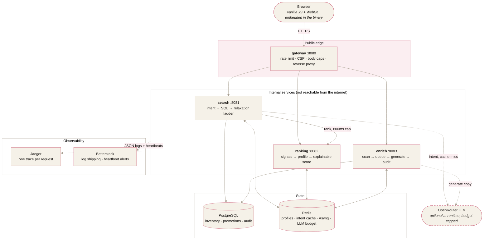

# 🧭 Fernweh

*Fernweh (German): the ache for far-off places.*

A working slice of an AI-first travel platform: natural-language search with
zero dead ends, personalized ranking with bounded business rules, and a
self-healing content pipeline. Four Go services, no web framework, built with
Claude Code and owned end to end: spec, code, tests, tracing, deploy.

**Why this exists:** it is a portfolio project deliberately shaped like a
production travel backend. Same stack, same operational concerns, same product
trade-offs. The specs live in [docs/PRD.md](docs/PRD.md); the AI-assisted
workflow, including the bugs the AI wrote and how they were caught, is in
[docs/BUILDLOG-claude-code.md](docs/BUILDLOG-claude-code.md).

## Live

### **[62-238-40-106.sslip.io](https://62-238-40-106.sslip.io)**

Three product pages, all working against real inventory:

| | |
|---|---|
| [/search/](https://62-238-40-106.sslip.io/search/) | Type a trip in a sentence. Try *"A beach weekend under €1,000 in March"*, or auf Deutsch *"Städtetrip nach Wien im Oktober, ruhig und günstig"* |
| [/recommendations/](https://62-238-40-106.sslip.io/recommendations/) | One candidate set ranked twice, cold against a persona, animating from one order into the other |
| [/content/](https://62-238-40-106.sslip.io/content/) | Break sixty listings and watch the queue repair them |

Running without a model key, so the intent badge reads `Rules parsed` and every
response carries `degraded: llm_unavailable`. That is the deterministic path
doing its job, disclosed rather than hidden, and it is the same thing you get
when the model is down.

## Or run it in two minutes

```bash
git clone https://github.com/Vijay190899/fernweh && cd fernweh
cp .env.example .env        # optional: add an OpenRouter key for live AI
docker compose up --build   # postgres + redis + jaeger + 4 services, seeded
```

- **Demo:** http://localhost:8080
- **Jaeger:** http://localhost:16686. Every search response links its own
  trace (the `trace ↗` link in the results bar).
- **No API key?** Everything still works, exactly as the deployment above does.

## Architecture



The dashed LLM edges are the point of the design: they are the only optional
paths in the system. One client (`platform/llm`) owns all model access, spends
against a daily Redis budget, and refuses cleanly (`ErrUnavailable`) when the
key is missing, the budget is gone, or the provider is slow. Every caller is
forced by that contract to carry a deterministic fallback, so the platform's
availability is never a function of the AI's availability.

More depth, including a request sequence diagram, the enrichment state
machine, the failure-mode table, and honest scaling answers:
[docs/ARCHITECTURE.md](docs/ARCHITECTURE.md).

## What to look at

| The claim | Where to see it |
|---|---|
| One sentence in, ranked live inventory out | Search tab; intent pills show what was understood and which engine did it (LLM, rules, or cache) |
| Zero dead ends, with disclosed trade-offs | Search *"5-star ski chalet in Zermatt under €50"* and read the yellow banner |
| Personalization you can inspect | Click and book a few beach stays, search again, and watch re-ranking, per-result "why" pills, and the profile panel |
| Business rules, bounded and disclosed | Promoted listings carry a ribbon and a reason; they can tip near-peers but never bury a better match (there is a test for both directions) |
| Content that heals itself | Content Ops tab: run a scan, watch the queue drain, click enriched rows for before/after diffs with audit provenance |
| One trace across a queue boundary | Open an enrichment trace in Jaeger: scan → Redis → worker → Postgres is a single trace |
| Degrades, never dies | `docker compose stop ranking` mid-session; searches keep answering with a `degraded` flag |

## Performance, measured

There is no QA team behind this repo, so the numbers are produced by tools in
the repo, not asserted. `tools/loadgen` drives mixed natural-language queries
at the real gateway; Go micro-benchmarks cover every decision hot path.

<picture>
  <source media="(prefers-color-scheme: dark)" srcset="docs/assets/latency-dark.svg">
  
</picture>

### Load sweep

Whole stack (4 services + Postgres + Redis + Jaeger) in Docker Compose on a
dev laptop (Ryzen 5 5600), deterministic-parser mode, per-IP rate limit raised
for the test, 20 seconds per rate:

| Rate | Requests | Errors | p50 | p95 | p99 | max |
|---:|---:|---:|---:|---:|---:|---:|
| 25 rps | 500 | 0 | 4 ms | 5 ms | 7 ms | 16 ms |
| 50 rps | 1,000 | 0 | 4 ms | 5 ms | 7 ms | 14 ms |
| 100 rps | 2,000 | 0 | 4 ms | 5 ms | 6 ms | 13 ms |
| 200 rps | 4,000 | 0 | 4 ms | 5 ms | 6 ms | 16 ms |
| 400 rps | 7,998 | 0 | 4 ms | 5 ms | 7 ms | 38 ms |

Latency is flat across a 16x load range: the interactive path is two indexed
Postgres queries plus Redis lookups, nowhere near saturation on a laptop.

### Micro-benchmarks

`go test -run '^$' -bench . -benchmem ./internal/...` on the same machine:

| Hot path | ns/op | B/op | allocs/op |
|---|---:|---:|---:|
| Fallback intent parse | 14,835 | 571 | 11 |
| Relaxation ladder | 1,348 | 5,235 | 10 |
| Rank 30 candidates | 10,522 | 4,827 | 88 |
| Rank 200 candidates | 91,054 | 26,793 | 503 |
| Template generation | 910 | 496 | 14 |
| Content hash | 638 | 304 | 12 |

The entire no-LLM decision path (parse + ladder + rank) costs under 50µs per
request. Request latency lives in the database, where it belongs.

### Ranking quality

Offline evaluation over the seeded catalogue, 300 listings and 6 personas
declared in `internal/ranking/eval.go` with a stated 0–3 grading rule. The
baseline is the identical scorer with an empty profile, which is what a
first-time visitor receives. Regenerate with `go run ./tools/rankeval`.

| Metric | Personalized | Baseline | Lift |
|---|---:|---:|---:|
| NDCG@10 | **0.7597** | 0.1112 | 6.8x |
| Precision@10 | **0.8833** | 0.1000 | 8.8x |
| MAP@10 | **0.9630** | 0.2618 | 3.7x |
| Recall@10 | 0.2913 | 0.0287 | 10.2x |
| Catalogue coverage | 19% | 3% | of a 20% ceiling |

**What is deliberately absent:** click-through and conversion, which need live
traffic and cannot be honestly produced by a demo with no users; and RMSE, MAE
and MSE, which evaluate rating prediction, while this system ranks and never
predicts a rating. Diversity@10 is *lower* when personalized, which is the
intended trade rather than a regression.

A number nobody can watch is a weak claim, so `POST /api/compare` holds one
candidate set still and varies only the profile. Across six personas, **25 to
29 of 30 candidates change position**, the persona's own category takes first
place every time, and the cold column is byte-identical across all six runs —
which is the property that makes the comparison mean anything. Method and per
persona breakdown: [docs/EVALUATION.md](docs/EVALUATION.md).

### Cost control

The AI layer is metered rather than hoped about. One client owns all model
access and spends against a daily counter in Redis, so a public demo cannot
drain an API balance:

| Call | Tokens (in/out) | Cost at Haiku 4.5 rates |
|---|---|---:|
| Intent extraction | ~385 / ~50 | $0.00064 per uncached query |
| Content enrichment | ~335 / ~120 | $0.00094 per listing |
| Full enrichment sweep | 126 listings | ~$0.12 |

Model-derived intents cache in Redis for 24 hours, so repeat queries and the
example chips cost nothing after the first call. A reading produced by the
deterministic parser caches for ten minutes and keeps reporting itself as a
fallback, so a model outage is neither retried on every request nor quietly
promoted to the cached truth for a day. The shipped default of 500 calls per
day caps worst-case spend near $0.32 per day, and the platform keeps working
at full function past the cap because the deterministic paths take over.

### Resilience checks, run by hand

- `docker compose stop ranking` mid-session: searches keep answering,
  flagged `degraded: [ranking_unavailable]`.
- No OpenRouter key: the full demo runs on deterministic fallbacks.
- Burst of 25 requests against the default rate limit: 15 pass, 10 get
  clean 429s with `Retry-After`.

## Quality

```bash
go test ./...     # parsers, ladder, scorer bounds, claim/release semantics,
                  # LLM error mapping, seed integrity, rate limiter, log
                  # shipper, degradation paths; table-driven, no mock libraries
go vet ./...
```

Testing philosophy and the bugs the suite caught (a substring match that sent
"romantic" queries to Rome, a thousands separator that parsed €1,000 as €0):
[docs/BUILDLOG-claude-code.md](docs/BUILDLOG-claude-code.md).

### What `go test` cannot see

`tools/audit/` drives the running stack the way a visitor would and fails on
anything a visitor would notice. It exists because every defect in the table
below returned *a* correct-looking answer, which is exactly why unit tests
agreed with all of them.

```bash
docker compose up -d && cd tools/audit && npm install
node browser.js          # pages, controls, layout, console, dead links
BASE=https://62-238-40-106.sslip.io node api.js   # or point it at a deployment
```

| Found | Why the test suite was blind to it |
|---|---|
| Duplicated `X-Trace-Id`, so every Jaeger link was dead | Both values were correct; only the header count was wrong |
| 502 for an oversized body, an unknown path, an upstream 4xx | Each returned a response, just the wrong claim about whose fault it was |
| Signals logged `ERR_ABORTED` while succeeding | The write landed; only the browser disagreed |
| Pages draggable sideways on a phone | True for 800 ms, mid-animation |
| 172 requests to watch one queue drain | Nothing failed; it was simply near enough the rate limit to break under a second tab |
| Background greying out under `prefers-color-scheme: dark` | Nothing else on the page reads that query |
| `demo-reset` breaking 0 rows on a fresh deployment | Only reachable in the state a reviewer arrives in |
| A cached fallback reporting itself as a cache hit | Correct on the first request; the disclosure vanished on the second |

The last two were found by deploying, not by reading. The suites exit non-zero
on the first problem, so they drop into CI unchanged.

## Why things are the way they are

`docs/brain/` is an [Obsidian](https://obsidian.md) vault kept beside the
code. Every significant decision has a note recording the context, the
mechanism, **what was rejected and why**, and what it costs. Open that folder
as a vault for the graph view, or start at
[docs/brain/Home.md](docs/brain/Home.md).

The repository also configures Claude Code rather than only prompting it:
`CLAUDE.md` holds the architectural invariants, `.claude/commands/` holds
project slash commands, `.claude/settings.json` registers hooks that format
Go after every edit and refuse to end a session on a broken build, and
`.claude/agents/` defines a read-only reviewer with a narrow brief.

## Repo map

```
cmd/            gateway · search · ranking · enrich · seed (one main each)
  mcp-inventory/  the catalogue over Model Context Protocol, JSON-RPC on stdio,
                  so an assistant gets typed tools instead of a database password
internal/
  platform/     config · logging (slog + trace ids + Betterstack shipping)
                · otelx · httpx · db (pgx + embedded migrations + the advisory
                lock that migrates and seeds on boot) · redisx (bounded, because
                an advisory cache must never stall a request) · betterstack
                · the LLM door (budget guard + fallback contract)
  inventory/    domain model · repo (dynamic filters, guarded transitions,
                audited enrichment writes)
  search/       intent (LLM and deterministic parser, cached with its source
                so a degraded reading stays disclosed) · relaxation ladder
                · the cold/warm comparison endpoint
  ranking/      signal store · profile · explainable scorer · offline evaluation
                harness · rank-twice comparison
  enrich/       scanner · Asynq pipeline · fact-grounded generators
web/            demo UI: vanilla JS, one landing page and three product pages,
                a hand-written WebGL noise field, self-hosted fonts, embedded
                into the gateway binary
tools/
  loadgen/      load generator behind the latency table above
  rankeval/     regenerates EVALUATION.md and web/eval.json from the catalogue
  audit/        drives the running stack in a browser and over HTTP, and fails
                on what go test cannot see
deploy/         production overlay · Caddy overlay (TLS, no PaaS) · setup.sh,
                one-command provisioning for Oracle or Hetzner
docs/           PRD · architecture · evaluation · security · build log
                · deployment, with Oracle and Hetzner walkthroughs
  brain/        Obsidian vault: the decisions, and what was rejected
.claude/        project commands, formatting/build hooks, reviewer subagent
```

## Deploying

Local mirrors production by design: the same compose stack, so the services,
PostgreSQL, Redis and Jaeger running at the link above are the ones described
here rather than substitutes. One overlay adds restart policies and memory
limits, another puts Caddy in front for TLS.

```bash
curl -fsSL https://raw.githubusercontent.com/Vijay190899/fernweh/main/deploy/setup.sh | bash
```

One command on a fresh Ubuntu host provisions the whole thing and prints the
URL. It detects whether it is on Oracle or Hetzner, because the firewall is the
part that differs and the wrong assumption there fails silently. No domain is
needed: the certificate is issued against a `sslip.io` hostname derived from
the IP.

[DEPLOYMENT.md](docs/DEPLOYMENT.md) · [ORACLE.md](docs/ORACLE.md) (permanently
free, capacity permitting) · [HETZNER.md](docs/HETZNER.md) (about €7 a month,
available now)

---

Built by **Vijay Ananth** with Claude Code · Go · PostgreSQL · Redis · Asynq ·
OpenTelemetry · Jaeger · Betterstack · no web framework
