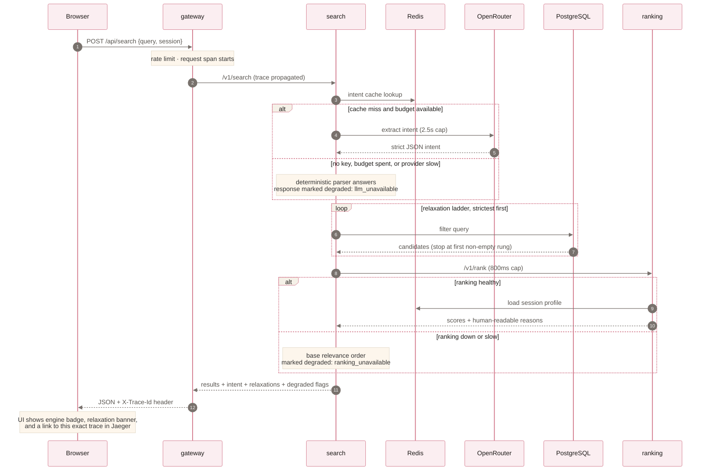
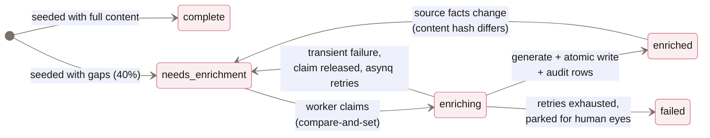
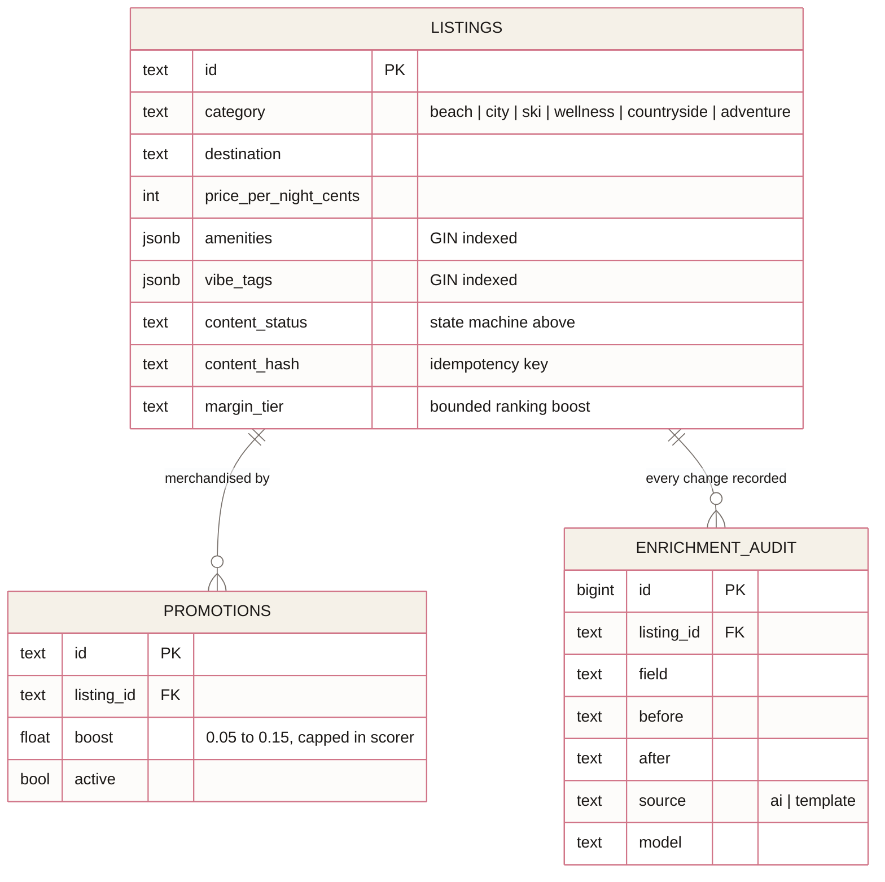
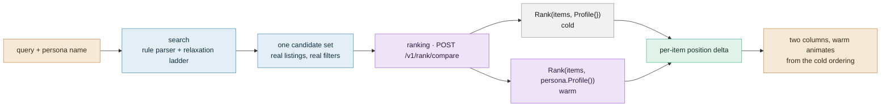

# Fernweh Architecture

How the system works, why it is shaped this way, and how it would grow into a
real production platform. Written to be read alongside the code.

## Anatomy of a search request

Everything above is one Jaeger trace. The enrichment path extends the same
property across the queue: trace context is serialized into the Asynq task
payload (`otelx.InjectMap` / `ExtractMap`), so scan → Redis → worker →
Postgres renders as a single trace.

## The enrichment state machine

Listings carry a `content_status` that only moves through guarded SQL
compare-and-set transitions, which is what makes concurrent workers and
overlapping scans safe:

Idempotency exists at two levels: the claim guard (a listing can only be
processed by one worker at a time) and a content hash of the source facts (if
nothing changed, re-enriching is a no-op).

## Data model

Session profiles deliberately do not appear here: they live in Redis with a
7-day TTL and no PII, keyed by an anonymous session id. The GDPR surface is
near zero, and the `SignalStore` interface is the seam where a durable,
consented profile store would slot in.

## Why these shapes

**Single Go module, four binaries.** Services are isolated by package
boundaries and deployment units, not by repos. Shared platform code
(`internal/platform`) changes atomically with its consumers: no internal
version skew, one `go test ./...` for the whole platform.

**No web framework.** Go 1.22+ `http.ServeMux` has method and path routing;
`net/http` has everything else. The entire "framework" needed is about 120
lines in `httpx` (lifecycle, JSON, health), reviewable in one sitting, with
no magic in the request path.

**Interfaces at the consumer.** `search.Inventory`, `search.Ranker`,
`enrich.Store`, and `enrich.Generator` are declared where they are used,
sized to what the consumer needs, and faked in tests without a mock library.

**The LLM is treated as the least reliable dependency.** One client
(`platform/llm`) owns access. It can refuse (`ErrUnavailable`) for budget,
key, latency, or provider reasons, and every call site is forced by that
contract to have a deterministic answer ready.

**Queues for anything not user-facing.** Enrichment latency is irrelevant to
travelers, so it runs at bounded concurrency (2 workers) off an Asynq queue
with retries, backoff, and TaskID dedup. It can never starve the interactive
path of database connections.

## Showing that ranking does anything

Ranking is the hardest service to believe, because a working ranker and a
broken one produce the same-looking page. Worse, the pipeline hides its own
work: the SQL filters narrow candidates before the scorer runs, so most of what
personalization would have reordered was never a candidate.

`POST /api/compare` holds the candidate set still and varies only the profile.
Search owns the endpoint because the candidates must come from the database
through the real relaxation ladder; ranking owns the double scoring because the
scorer and the personas live there. The persona is passed by name and resolved
against `Personas()`, so a caller cannot supply a profile and manufacture a
result. Numbers and method are in [EVALUATION.md](EVALUATION.md).

## Failure modes, by dependency

| Dependency | Failure behavior |
|---|---|
| OpenRouter | Fallback parser / template generator; `degraded: llm_unavailable`; UI badge flips to "rules parsed" |
| Ranking service | Search returns base relevance order; `degraded: ranking_unavailable` |
| Redis (cache, profiles) | Intent extraction skips cache; ranking runs cold; budget guard fails open |
| Redis (Asynq) | Enrichment pauses; interactive search unaffected |
| PostgreSQL | Search fails (it is the inventory); health checks flip and the orchestrator restarts |
| Jaeger | Spans drop; requests unaffected (batch exporter, fire and forget) |
| Betterstack | Log copies drop from a bounded queue; stdout stays authoritative; requests unaffected |

## What changes at real scale

Honest answers to "this is a demo, what breaks first?":

1. **Search retrieval.** ILIKE plus GIN filters are fine for tens of
   thousands of listings. Past a million, with fuzzy destination matching,
   retrieval moves to Postgres FTS or OpenSearch; the intent and relaxation
   logic operates on the `Filter` abstraction and does not change.
2. **Ranking features.** The linear scorer is deliberately explainable. At
   scale it becomes the baseline in an A/B test against a learned ranker
   behind the same `/v1/rank` contract, with the reasons channel fed by
   feature attributions.
3. **The relaxation ladder** runs up to about ten sequential queries in the
   worst case. Batch the rungs into one query with scoring tiers, or
   precompute destination and category counts to skip empty rungs.
4. **Session profiles** move from per-request HGetAll to a small local cache
   with pub/sub invalidation if rank QPS grows.
5. **Enrichment throughput** scales by raising Asynq concurrency and
   sharding queues per content type; the claim guard already makes workers
   horizontal.
6. **Multi-tenancy** (the enterprise integration story): tenant ids plus
   per-tenant business rules and budgets; the gateway becomes the SSO
   termination point (OIDC) and services stay tenant-blind behind it.

## Security posture

Internet reaches the gateway only. Internal services listen on the compose
network. Per-IP token buckets and a body-size cap at the edge; strict CSP; no
secrets in the repo; the only credential (OpenRouter) is env-injected and
budget-capped, so leaking the demo URL cannot drain it. Jaeger sits behind
basic auth in production.
